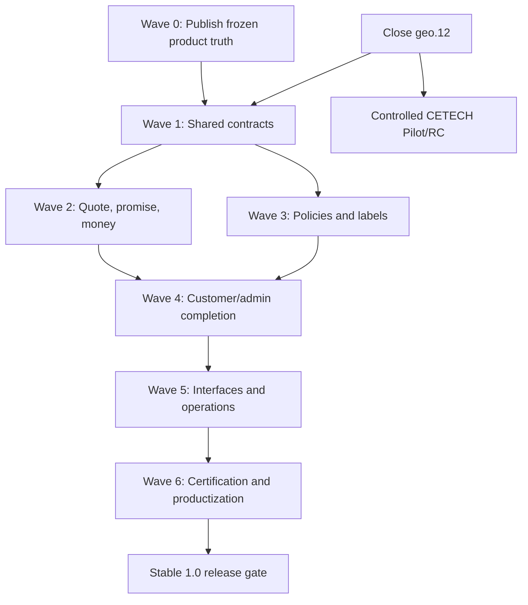

# CETECH Delivery Standalone Realignment Plan

Status: owner-approved on 2026-09-19; implementation authorized subject to the dependency gates below. Until geo.12 closes, PR #24 remains the only authorized runtime implementation stream.

## 1. Geography-stream decision

**A — FINISH GEO.12 FIRST.**

Reason:

- geo.11 represents 18 commits, 129 changed paths, schema 6 and a coherent new geography/coverage subsystem;
- the owner/architect review explicitly reduced the remaining work to a finite, closed correction set and named geo.12;
- the unresolved defects affect migration, identity, destination matching and scale—foundational truth that future quote/promise/policy work will consume;
- pausing with geo.11 unaccepted would leave two destination models and a known-unsafe migration coordinator in limbo;
- mixing this broader audit into PR #24 would contaminate its evidence, enlarge its schema/runtime risk, and violate the explicit issue boundary.

Therefore complete geo.12, perform the promised differential plus one whole-branch closure review, then physical QA and explicit owner acceptance. Do not start unrelated capability implementation in the same branch. The approved documentation/control-plane publication proceeds in parallel on `docs/product-control-plane`; no other runtime implementation stream may overlap geo.12.

## 2. Realignment dependency graph

The split between Waves 2 and 3 permits bounded parallel planning after shared contracts freeze, but central schema/snapshot/interface files require one integration editor.

## 3. Wave plan

### Pre-wave — close the active geography stream

**Requirements:** `DE-GEO-*`, `DE-AREA-*`, affected `DE-GLOBAL-*`, `DE-PERF-*`, `DE-DIAG-*`, `DE-DATA-*`.

**Work:** implement only PR #24 comment `5732836980`; add real-DB service/concurrency/scale evidence; run exact package technical/physical gates; obtain owner acceptance; merge decision separately.

**Affected areas:** geo.11 geography/coverage services/repositories, migration, destination matcher, admin/storefront JS, diagnostics, location-pack admin, real-DB tests.

**Schema/migration:** remain schema 6 unless an unavoidable reviewed correction proves otherwise; no opportunistic new product tables.

**Owner:** current sole owner `@wbdevworld`; do not invent Ben/Emmanuel approval roles.

**Stop condition:** no known P1/P2 technical blocker after one final closure review; then stop static candidate iteration and enter physical QA.

### Wave 0 — freeze product truth and execution control

**Priority:** P0 product integrity.
**Requirements:** `DE-FAM-*`, `DE-OWN-*`, all stable ID governance.

**Work:** the owner accepted this package, resolved the six decisions, and froze `STABLE-1.0-SCOPE-1`. Publish the approved artifacts on the dedicated documentation branch, assign governing responsibility in `docs/AUTHORITY.md`, update live control-plane status, and preserve old stage documents as historical evidence rather than deleting them.

**Schema/runtime:** none.

**Tests/control:** add a lightweight registry/schema validator and documentation-file check as part of the approved publication.

**Owner/workstream:** owner/WS3; repository documentation PR; no active-feature branch reuse.

### Wave 1 — foundational shared contracts

**Priority:** P1 architecture.
**Requirements:** `DE-RULE-*`, `DE-DATA-*`, `DE-FLAG-*`, public stability portions of `DE-API-*`, snapshot extension portions of `DE-SNAP-*`.

**Work packages:**

1. Versioned policy/rule record and effective-date contract.
2. Stable public/internal/experimental contract classification and error/correlation/idempotency primitives.
3. Snapshot extension/versioning strategy that preserves V1/V2 reads.
4. Retention/cleanup registry and emergency-disable contract.
5. Common explainability/audit context used by quote, policy, labels and override work.

**Affected areas:** new Domain/Application contracts; `OrderDeliverySnapshot*`; migration framework; diagnostics; feature flags; package/public-contract docs.

**Schema/migration:** additive only; historical snapshots stay readable; any central schema lease belongs to one editor.

**Tests:** contract tests, old-snapshot fixtures, migration/rollback failure tests, permission/idempotency tests.

**Recommended ownership:** WS3 core/schema/integration editor; WS2 reviews Woo lifecycle contracts; WS1 reviews customer-safe presentation contracts.

### Wave 2 — quote, promise, price and economics

**Priority:** P1/P2.
**Requirements:** `DE-QUOTE-*`, `DE-PROMISE-*`, `DE-PROMO-*`, `DE-ECON-*`, `DE-FX-*`, `DE-TAX-*`, relevant `DE-LOG-*`, `DE-ORIGIN-*`, `DE-PICKUP-*`.

**Work packages:**

1. First-class DeliveryQuote aggregate, fingerprint, status, TTL and acceptance/revalidation.
2. Versioned service/promise policy with calendars, closures, cutoffs and truthful ETA.
3. Separate base rate, promotion/subsidy and private economic components at schema/contract level; defer deeper reconciliation and shared-leg allocation until post-1.0.
4. Currency adapter and convert-once provenance.
5. Snapshot integration and compatibility migration from current `RateQuoteResult` flows.

**Protected reuse:** retain `RateQuoteEngine`, Rate Cards, native Woo shipping and fail-closed package exclusivity as calculation/execution primitives; do not rewrite them merely to introduce lifecycle identity.

**Schema/migration:** likely additive quote/policy/economic tables plus snapshot V3 fields; short-lived quote cleanup; no mutation of historical order snapshots.

**Tests:** quote idempotency/expiry/revalidation, capacity TTL separation, calendar/cutoff edges, currency conversion once, promotion precedence/budgets, private-payload tests, Classic/Blocks/PDP parity, concurrency and real DB.

**Recommended ownership:** WS3 domain/schema; WS2 Woo cart/checkout/order integration; WS1 customer UX after contracts freeze.

### Wave 3 — Return Policy, Refund Policy and Fulfillment Labels

**Priority:** P2 missing Stable 1.0 capability.
**Requirements:** `DE-RETURN-*`, `DE-REFUND-*`, `DE-LABEL-*`, relevant `DE-CONFIG-*`, `DE-RULE-*`, `DE-SNAP-*`.

**Work packages:**

1. Separate Return Policy aggregate/repository/admin/inheritance/presentation/snapshot.
2. Separate Refund Policy aggregate/repository/admin/inheritance/presentation/snapshot.
3. Label taxonomy/rules/schedule/surfaces/structured wait data/snapshot.
4. Shared policy effective-resolution service using existing scoped-configuration concepts without collapsing distinct policy types.

**Schema/migration:** additive policy versions/assignments and labels; preserve complete historical content on order snapshots; no policy object that conflates return and refund.

**Tests:** global/fulfillment/product/variation resolution, independent override chains, effective dates, acknowledgements, translation, accessibility, cart/checkout/order rendering, immutable snapshot, bulk operations.

**Recommended ownership:** WS3 domain/schema; WS1 customer/admin surfaces; WS2 checkout/order persistence.

### Wave 4 — customer, staff and operational completion

**Priority:** P2.
**Requirements:** remaining `DE-PICKUP-*`, `DE-LOG-*`, `DE-ORIGIN-*`, `DE-UX-*`; bounded 1.0 portions of `DE-EXC-*` and `DE-NOTIFY-*` if owner includes them.

**Work:** pickup schedules/closures/readiness/disclosure/capacity; logistics constraint completeness; multi-origin operational truth; coherent preview and Needs Attention; final admin/customer simplification across quotes/promises/policies/labels.

**Schema/migration:** additive operational fields/version records; privacy/minimization review for coordinates and instructions.

**Tests:** admin form lifecycle, mobile/keyboard/screen reader, public/private payload, booking/capacity edge cases, Classic/Blocks parity, actual theme browser QA.

**Recommended ownership:** WS1 presentation/a11y; WS2 Woo lifecycle; WS3 core/privacy/integration.

### Wave 5 — APIs, CLI, events and operations

**Priority:** P2.
**Requirements:** `DE-API-*`, `DE-CLI-*`, `DE-EVENT-*`, `DE-DIAG-*`, `DE-SEC-*`, `DE-PERF-*`.

**Work packages:**

1. Versioned REST namespaces and OpenAPI/JSON Schema generated/validated from shared contracts.
2. Broad WP-CLI commands for status, doctor, geography, fulfillment, quotes, orders, shipments, policies, jobs, cache and database.
3. Versioned domain events and signed/replay-protected webhook outbox/delivery.
4. Correlation, structured errors, ETag/concurrency, idempotency and pagination.
5. Abuse controls, retention, monitoring and operator recovery.

**Schema/migration:** possible webhook subscription/outbox/delivery tables; indexes and retention jobs; no separate CLI/API business implementation.

**Tests:** OpenAPI contract tests, authorization matrix, idempotency/replay, webhook retry/dead-letter, CLI machine output/exit codes/dry-run, rate limiting, load/bounded iteration.

**Recommended ownership:** WS3 core/security/contracts, WS2 Store API/Woo integration, WS1 public error/accessibility review.

### Wave 6 — compatibility, productization and release

**Priority:** P3.
**Requirements:** `DE-COMPAT-*`, `DE-REL-*`, remaining `DE-GLOBAL-*`, certification aspects of security/performance/UX.

**Work:** implement chosen adapters only; certify WooCommerce/HPOS, Classic, Blocks, Storefront, current supported WoodMart, B2BKing, and FOX/WOOCS; certify WPML/WCML only if advertised at launch. Finalize an independent direct commercial distribution/updater/licensing mechanism, signing, support versions, telemetry choice, SBOM/license notices, rollback channels, release notes and training. Replace the CETECH working name before the main Stable 1.0 commercial release.

**Schema/runtime:** provider adapters stay at edges; productization must not change canonical business truth.

**Tests:** exact version matrix, licensed plugin labs, upgrade/rollback rehearsal, reproducible package/checksum/SBOM, cache/session isolation, accessibility and performance budgets.

**Recommended ownership:** WS3 release/integration; WS1 theme/a11y; WS2 Woo/adapter matrices; owner commercial decisions.

### Post-1.0 waves

Implement `DE-JOURNEY-*`, advanced `DE-EXC-*`, `DE-NOTIFY-*`, `DE-OVR-*`, `DE-ANALYTICS-*`, deeper economics reconciliation/shared-leg allocation, and additional adapters as bounded modules. Keep `DE-DEFER-*` deferred until explicitly reopened. Build Connected-only work in its separate product.

## 4. Protected / do-not-reopen register

| Protected foundation | Why protected |
|---|---|
| RC.11 tag, source identity and qualified ZIP checksum | Immutable accepted release evidence |
| Protected `master` workflow and recovery/provenance history | Auditable collaboration truth |
| Modular-monolith Domain/Application/Infrastructure/Presentation layering | Sound foundation with extensive tests |
| Field-level scoped configuration and Effective Configuration Resolver | Authoritative, tested inheritance model |
| Genuine Woo shipping method and server-side selected-offer rate | Native compatibility and monetary authority |
| Fail-closed managed-package exclusivity | Prevents silent free/wrong shipping |
| PDP authoritative price, quantity parity and no implicit store-country quote | Owner accepted in RC.11 |
| Classic and Blocks shared business behavior | Qualified and regression tested |
| Per-item customer context, delivery-group identity and multi-destination architecture | Stronger accepted implementation |
| Immutable order snapshot versioning and historical reads | Contractual integrity; extend, never rewrite |
| Shipment aggregate/idempotency/events/status separation | Sound provider-neutral V1 foundation |
| Bulk job/Action Scheduler/rollback-fingerprint architecture | Safe reusable large-work foundation |
| Administrator access recovery and WCFM admin isolation | Security/operability safeguards |
| Integration status truth model | Prevents false compatibility claims |
| Canonical geography IDs, provider-neutral packs and coverage-group architecture | Sound active-stream direction; fix known correctness defects, do not revert to free text |

## 5. Proposed GitHub execution structure

The owner approved the audit and implementation plan on 2026-09-19. Create later milestones and issues only when their predecessor gate is ready; approval does not authorize concurrent runtime streams while geo.12 is active.

### Milestones

1. `Geo schema-6 closure` — existing issue #23/PR #24 only.
2. `Product Truth & Control Plane` — publication of approved artifacts.
3. `Stable 1.0 Foundations` — Wave 1.
4. `Quote, Promise & Policy` — Waves 2–3.
5. `Stable 1.0 Interfaces` — Wave 5.
6. `Stable 1.0 Certification & Release` — Wave 6.
7. `Post-1.0 Product Completion` — later capabilities.

### Suggested issue epics

- `EPIC: First-class DeliveryQuote and revalidation`
- `EPIC: Delivery service and promise policy`
- `EPIC: Delivery promotions and private economics`
- `EPIC: Independent Return Policy`
- `EPIC: Independent Refund Policy`
- `EPIC: Fulfillment Labels & Product Promise`
- `EPIC: Public contracts, OpenAPI and Store API parity`
- `EPIC: WP-CLI operational surface`
- `EPIC: Domain events and signed webhooks`
- `EPIC: Retention, diagnostics and emergency controls`
- `EPIC: Compatibility and commercial productization`

Every issue and PR should name exact requirement IDs. Avoid a single “realign everything” branch.

### Branch and PR model

- keep `master` canonical/protected;
- finish current `feat/canonical-geography-coverage` only for issue #23;
- publish approved audit docs on a dedicated `docs/product-control-plane` branch;
- use bounded `ws1/**`, `ws2/**`, `ws3/**` task branches;
- use a temporary `batch/**` integration branch only for a multi-owner milestone after contracts freeze;
- never create permanent `develop`, `qa`, `uat`, or `integration` branches solely for coordination;
- one active editor for snapshot schema, plugin bootstrap, migration registry and shared OpenAPI/event contracts;
- exact tested-SHA handoffs; review fixes return to original owner unless explicitly reassigned.

## 6. Proposed canonical documentation structure

After approval, publish under `docs/product/`:

- `README.md` — authority/index/source coverage;
- `PRODUCT-CONSTITUTION.md` — identity/invariants;
- `CAPABILITY-REGISTRY.yaml` — machine authority;
- `CAPABILITY-REGISTRY.md` — human rendering;
- `DESIGN-CODE-TRACEABILITY.md` — current conformance/evidence;
- `DECISION-CONFLICT-REGISTER.md` — chronology/supersessions/open decisions;
- `COMPATIBILITY-CERTIFICATION.md` — claims/evidence matrix;
- `RELEASE-SCOPE.md` — Stable 1.0 boundary;
- `REALIGNMENT-PLAN.md` — approved execution waves;
- `AUDIT-MANIFEST.yaml` — resumable audit state.

Complement rather than delete `docs/AUTHORITY.md`, governance, status, release and historical stage documents. Update `readme.txt`, `CURRENT-WORK.md`, and `docs/STATUS_CURRENT.md` at appropriate release checkpoints. Mark historical design files as historical/superseded and link forward; do not rewrite history to appear linear.

## 7. Exact owner sequence

1. Keep RC.11 immutable and PR #24 Draft.
2. **Completed 2026-09-19:** accept the audit, freeze product truth, resolve the six decisions, and approve the realignment plan.
3. Publish the approved control-plane artifacts through their own reviewed documentation PR.
4. In parallel, build only geo.12’s finite correction list and perform the promised final technical review.
5. If technically clean, physically QA the exact geo.12 package and obtain explicit owner acceptance.
6. Create a controlled CETECH production Pilot/release candidate; do not assume the name RC.12 and do not deploy without separate control.
7. Execute Waves 1–6 through requirement-ID issues and bounded PRs after the geo.12 predecessor gate; do not run a second runtime stream concurrently with geo.12.
8. Requalify clean install, RC.11 upgrade, compatibility, security, performance, accessibility and package integrity on the final Stable 1.0 candidate.
9. Make an explicit Stable 1.0 go/no-go decision; do not infer it from green CI or merged code.
