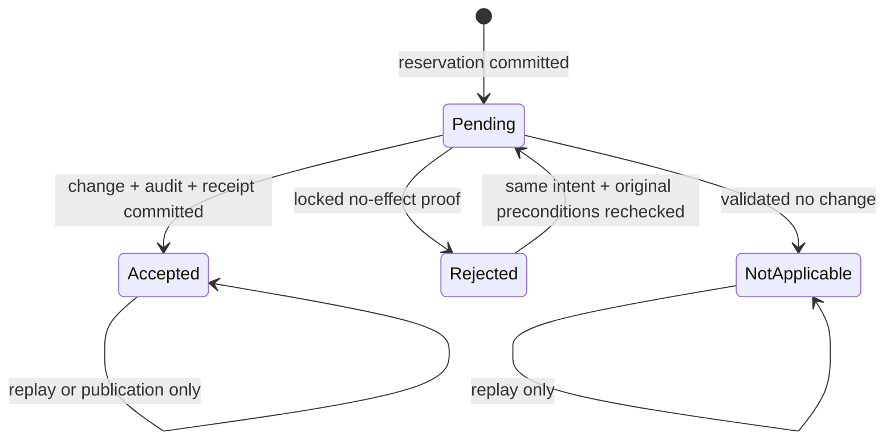

# W1-C03 durable request storage — W1-C03-STORAGE-1

Status: **PROPOSED DESIGN / NOT IMPLEMENTED**. Prepared under the owner's 2026-10-06 19:11:56 UTC instruction: “Approve W1-C02 for integration and prepare W1-C03’s storage design.” [Issue #62](https://github.com/WB-DevWorld/cetech-woocommerce-delivery-engine/issues/62) is this design task; [Issue #48](https://github.com/WB-DevWorld/cetech-woocommerce-delivery-engine/issues/48) remains the Wave 1 parent. This document proposes schema **7**; the actual code and installed qualification schema are still **6**. No DDL, new store, completion worker or existing-flow adoption is implemented by this document.

## Outcome in plain English

A request gets a durable record before it can change anything. The actual change, its required audit and its accepted result then commit together. A second attempt reads that record under the same database lock, so it either obtains the original result or proves that no change committed. A lost response cannot be treated as permission to repeat a change. Records are preserved; there is no automatic expiry or age-based takeover.

This is a foundation for future plugin-owned database operations. It does not promise exactly-once payments, carrier calls, email, WooCommerce orders or other external effects. Those adopters need their own concrete contracts. Existing scoped save/reset and their COR-007 audit completions keep their current implementation.

## Exact baseline and inspected reuse

Owner-approved C02 [PR #61](https://github.com/WB-DevWorld/cetech-woocommerce-delivery-engine/pull/61) candidate `f6f224b0e0c7e047cf93e97496b810a7135bf386` merged as `4dcfc160d7b4f5606ee899dc56216cae3aa9b882`, tree `148a87883fb44ac1ab42ffcee9d14603c4b45fbe`. Actual-master run `37517302600`, attempt 1, passed all eight jobs and independently downloaded native 207 / authenticated HTTP 66 / Store API smoke. Its exact 508-file installed map is `182d4c5aa2dddea3760a39ebfbe69cd2a8d1e0bc3d532a557cfad528f709c156`. This is integrated C02 evidence, not execution of the C03 cases below. Candidate and actual-merge archive/member fingerprints remain separately recorded in PR #61.

| Existing source | Reuse / limit |
|---|---|
| `src/Domain/Contracts/OperationIdentity.php`, `CanonicalIntent.php` | Reuse exact existing digests/limits; a digest never grants authority. |
| `OperationOutcome.php`, `ContractError.php`, `RequestContext.php` | Reuse factual acceptance versus uncertainty and rebuild safe errors with current attempt IDs. |
| C02 `DecisionProjection`, `DecisionAuditFacts` | Reuse purpose separation and accepted material facts; configuration-specific audit facts cannot be forged for another operation. |
| `tests/Unit/Contracts/InMemoryOperationModel.php` | Accepted semantic reference only; not persistence or concurrency proof. |
| `AbstractWpdbRepository::run_shared_unit()` | Reuse failure distinctions, not its implicit global/nested transaction ownership. An inner callback can return before outer commit. |
| Scoped service `completeLocalUnit`, `lockScopeIdentity`, `publishAcceptedRevision` and `ConfigurationAuditLogger::recorded_completion` | Preserve unchanged; do not migrate/reinterpret existing audit-token records. |
| `MigrationRunner`, `VerifiableMigrationInterface`, `SchemaVersion`, `MigrationStatus`, migration 6 | Reuse forward up/verify/version/status order and truthful retry; create a distinct verifiable migration 7. |
| `TableNames::for`, `ConfigurationTables::all_suffixes`, `Bootstrap/Uninstaller`, `uninstall.php` | Follow site table naming. Keep the new preserved store outside the existing broad missing-table/delete allowlist. |

## Proposed decisions to approve together

| Decision | Concrete choice |
|---|---|
| C03-D01 | Two new per-site InnoDB tables: request records and one immutable material-change event per accepted changed request. No existing audit table reuse. |
| C03-D02 | Schema 7 through the existing migration chain; isolated readiness for the new feature; legacy schema-6 services retain availability on migration failure. |
| C03-D03 | Persist C01 namespace-v1 and intent-v1 digests, with separate record/completion format versions. No raw token, full submitted payload or raw error storage. |
| C03-D04 | Commit a minimal pending reservation first. A separately owned unit locks it, changes the owned resource, appends audit and records acceptance atomically. |
| C03-D05 | Refuse nested/ambient ownership; use a dedicated authoritative, non-reconnecting session for each owned unit. All participating repositories receive that same session explicitly. |
| C03-D06 | Persist facts: pending, accepted, rejected or not_applicable. Lost acknowledgement is an unconfirmed response, never an observer's overwrite of possible acceptance. |
| C03-D07 | Reconciliation never invokes a business effect. It takes the same current row lock on a replacement session before resolving the original namespace. No lease/TTL takeover. |
| C03-D08 | A known rejection may retry only the same intent after original identity/revision and current authority checks. Accepted/not_applicable effects are never repeated. |
| C03-D09 | Publication is profile-defined, monotonic and separate; accepted mutation truth is immutable. Publication-only retry cannot append another audit or run another effect. |
| C03-D10 | Preserve all operation/material records by default, including on deactivate and both uninstall paths; no TTL, purge, destructive rollback or raw-payload archive. |
| C03-D11 | C03 exposes internal primitives only. Production profile/adopter list remains empty; a disposable counter fixture proves real persistence without changing an existing business flow. |
| C03-D12 | New real-database proof group is required in CI after implementation. Existing excluded COR groups remain separately described. No future proof is counted as executed now. |

## Exact proposed tables and indexes

Names resolve from the server's current site prefix, following `TableNames::for`. In the DDL below `{site_prefix}` is documentation substitution, never caller input. Both tables use the site's supported charset/collation for text and explicit case-sensitive ASCII for digests, vocabulary and profile names. No WooCommerce/WordPress table foreign key, trigger, generated JSON index or cross-site FK is introduced. DDL is a proposal, not an executable migration in this change.

```sql
CREATE TABLE {site_prefix}delivery_engine_operation_records (
  id bigint unsigned NOT NULL AUTO_INCREMENT,
  site_id bigint unsigned NOT NULL,
  namespace_hash char(64) CHARACTER SET ascii COLLATE ascii_bin NOT NULL,
  intent_hash char(64) CHARACTER SET ascii COLLATE ascii_bin NOT NULL,
  namespace_format smallint unsigned NOT NULL DEFAULT 1,
  intent_format smallint unsigned NOT NULL DEFAULT 1,
  record_format smallint unsigned NOT NULL DEFAULT 1,
  operation varchar(96) CHARACTER SET ascii COLLATE ascii_bin NOT NULL,
  operation_version bigint unsigned NOT NULL,
  target_hash char(64) CHARACTER SET ascii COLLATE ascii_bin NOT NULL,
  state varchar(24) CHARACTER SET ascii COLLATE ascii_bin NOT NULL,
  publication_state varchar(16) CHARACTER SET ascii COLLATE ascii_bin NOT NULL,
  completion_json longtext NULL,
  audit_id bigint unsigned NULL,
  row_version bigint unsigned NOT NULL DEFAULT 1,
  created_at datetime(6) NOT NULL,
  updated_at datetime(6) NOT NULL,
  completed_at datetime(6) NULL,
  PRIMARY KEY  (id),
  UNIQUE KEY site_namespace (site_id, namespace_hash),
  KEY site_state_id (site_id, state, id)
) ENGINE=InnoDB {site_charset_collate};

CREATE TABLE {site_prefix}delivery_engine_operation_changes (
  id bigint unsigned NOT NULL AUTO_INCREMENT,
  site_id bigint unsigned NOT NULL,
  operation_id bigint unsigned NOT NULL,
  event_format smallint unsigned NOT NULL DEFAULT 1,
  event_json longtext NOT NULL,
  created_at datetime(6) NOT NULL,
  PRIMARY KEY  (id),
  UNIQUE KEY operation_event (site_id, operation_id)
) ENGINE=InnoDB {site_charset_collate};
```

The full `site_namespace` unique index arbitrates simultaneous reservations. No prefix index or case-insensitive collation is sufficient. `operation_event` allows exactly one aggregate material event for one accepted changed request; future multi-event workflows need a separately versioned profile, not an implicit relaxation. `audit_id` references the matching same-site immutable event by application validation without a database FK. Hydration checks both directions before reporting accepted truth. Site/state/id supports bounded internal status inspection with identity pagination; no background scanner or public listing is enabled by C03.

IDs/site/version fields are positive PHP integers within `PHP_INT_MAX`; an exhausted counter refuses another write. Timestamp fields are real UTC microseconds; time never grants ownership. There is no expiry, lease-owner, heartbeat, raw-principal, address or raw-token column. `target_hash` is SHA-256 of `cetech-operation-target-v1:` plus the exact validated server-resolved target key; it is a private consistency check, not a public ID or reversible command.

### Encoding, bounded payloads and invariants

`namespace_hash` is the unchanged C01 `namespace_digest()`: SHA-256 over `cetech-operation-namespace-v1:` and the JSON tuple of site, authenticated authority/principal, operation/version, exact target key and token. Store lowercase 64-character hex, not a hash with a silently changed salt/canonicalization. Existing authority/principal/token/target byte limits and UTF-8 rules apply. The namespace is intentionally different across authorities, principals, sites, operations, versions and targets; it is not global deduplication across different tokens or actors.

`intent_hash` is the unchanged `CanonicalIntent::fingerprint()` of the original operation/version, target identity, opened row/revision/preconditions and validated semantic payload. Attempt/correlation IDs and timestamps stay out. Existing depth 32 / 4096 nodes / 262144 encoded-byte limits and type/list/omission distinctions remain. A hash cannot reconstruct a command: a permitted retry supplies the original validated envelope. Read-only reconciliation needs matching identity/intent and an authorized target, not a retained full payload.

`completion_json` is a strict, independently versioned private DTO, not PHP serialization, an arbitrary object, raw HTTP output or a public C02 serializer. Maximum encoded size **16384 bytes**, depth **8**, **256 nodes**; unknown keys/types/versions fail closed. Envelope keys are exactly `format`, `outcome`, `result`, `error`, `publication`. `result` and `publication` have a finite schema supplied by the registered operation/version profile; unregistered profiles refuse before reservation. Safe errors store only C01 code/recovery/allowed parameters/field violations, never request IDs, translated messages or exception text. Replay reconstructs a new C01 error with the current attempt IDs. Private result facts carry actual accepted row/version identities only when declared and necessary; generic result keys cannot accept addresses, raw input, supplier/origin/cost data or secrets.

`event_json` is a similarly bounded (16384 bytes / depth 8 / 256 nodes), strict immutable material-change DTO: `format`, `operation`, `operation_version`, `actor`, `target`, `reason_code`, `before_revision`, `after_revision`, `changed_fields`, `request_id`, `correlation_id`. The profile defines exact actor/target/changed-field/reason vocabularies; no arbitrary before/after field values or context/details blobs. Request/correlation identify the first accepted effect; retries do not edit this event. A service-principal profile must separately define its actor facts before adoption. Existing C02 configuration-only `DecisionAuditFacts` can be used only for its actual configuration operations, which C03 does not adopt.

| Durable facts | Required column/DTO invariants | C01 attempt result |
|---|---|---|
| pending | No completion, audit or completed_at; publication none. Immutable identity/intent already committed. | pending; outcome_unknown if resolving a transport ambiguity. |
| rejected | Typed safe known rejection; no audit; publication none; completed_at set. | rejected; a later same-intent retry revalidates before effects. |
| not_applicable | Typed no-change result; no audit; publication none; completed_at set. | not_applicable, terminal replay. |
| accepted, publication none/published | Typed accepted result; audit_id matches the unique same-site event; completed_at set. | accepted, terminal replay. |
| accepted, publication pending | Same immutable accepted result/event; declared publication descriptor. | awaiting_publication: mutation accepted=true, externally unconfirmed. |
| Unknown/corrupt/unsupported stored row for an existing namespace | Retain the record; no fabricated absent/rejected original completion and no effect. | outcome_unknown / reconcile_original_request, with mutation acceptance unknown; pending only where proved. |

All DTO/column/state relationships are validated before mutation and hydration; SQL defaults alone are not truth. Namespace/intent/op/version/target are immutable. An accepted receipt, its event and accepted revisions never change; only acknowledged publication status and row_version advance. No duplicate handler can overwrite intent, acceptance or a newer publication with a blind upsert. C01 temporarily_unavailable/unsupported_contract errors have rejected completion_outcome and may refuse the present request before reservation or when no original effect ambiguity exists; they must never misclassify an original effect that cannot be hydrated. That case uses OperationOutcome::unconfirmed with outcome_unknown, or proved pending, without modifying the stored original.

## Transaction owner and retry algorithm

### Connection and authority boundary

Resolve site, authenticated principal/authority, target/parent and profile on the server. Check current capability, object scope and profile purpose before any completion lookup/reservation; check again before mutation and before disclosing replay facts. Caller token/digest/request ID grants no authority. Request decoding/CSRF remains the eventual presentation adapter's responsibility; C03 adds no route or stable public API.

Use a dedicated native `wpdb`/mysqli connection factory with server-configured database authority and the current resolved site prefix. A new connection class prevents `check_connection()`/query retry from reconnecting or reissuing a statement inside an owned unit; do not mutate global `$wpdb`, global driver policy, WP options or another request's settings. Error printing/query retention is suppressed for this private transport. Pin the same session through START, locks, all writes and COMMIT; factory construction/replacement happens outside the unit. Retire uncertain sessions. The retired object remains unusable. Native WordPress is the first supported proof environment; custom database routing/replica drop-ins require an explicit equivalent authoritative factory, otherwise only this new feature refuses safely.

The owner refuses joining another transaction. No nested START, implicit-commit DDL, existing `run_shared_unit` wrapper, cross-connection repository, Woo CRUD/WordPress options callback, email or external API can be part of this unit. New internal repositories accept the owner connection explicitly; do not capture global repositories as mutation callbacks. A profile cannot claim that a global/nested callback's return is committed acceptance. Material writes, their required audit and completion must all use InnoDB on this session. Hooks/adapters must not create hidden effects inside the unit.

This design follows the inspected framework plus primary references: [WordPress query reconnect path](https://developer.wordpress.org/reference/classes/wpdb/query/), [MariaDB FOR UPDATE](https://mariadb.com/docs/server/reference/sql-statements/data-manipulation/selecting-data/for-update), [isolation/current versus snapshot reads](https://mariadb.com/docs/server/reference/sql-statements/administrative-sql-statements/set-commands/set-transaction), and [implicit-commit statements](https://mariadb.com/docs/server/reference/sql-statements/transactions/sql-statements-that-cause-an-implicit-commit). The no-reconnect/isolated-owner choice is a design inference from those behaviours; the future tests below must prove its actual implementation.

### A. Durable reservation

1. Authorize and validate the exact profile/command, canonical intent and storage readiness. Fresh owned transaction inserts one `pending` record using a plain INSERT. No mutation/audit/publication is performed here.
2. A proven duplicate-key error for `site_namespace` opens a current `SELECT ... FOR UPDATE` on that full same-site namespace and checks every identity/format/intent field. Changed intent returns intent_conflict without modifying the old record. Other SQL failures are never interpreted as duplicates or absence.
3. Acknowledged reservation commit permits the separate effect phase. Lost reservation acknowledgement retires the connection and returns unconfirmed; it must reconcile before a business effect. A fresh current unique-key lock/insert attempt can establish presence or safe absence; an ordinary SELECT or stale snapshot cannot.

### B. One owned effect/completion unit

1. Start a fresh owned transaction and current-lock the full reserved namespace first. The proposed dedicated-session `innodb_lock_wait_timeout` is **2 seconds**; timeout/deadlock causes explicit whole-unit cleanup and no effect. This is a lock responsiveness budget, not evidence that another transaction stopped. Existing 20-second HTTP client bounds and global runtime settings remain unchanged.
2. Validate persisted formats/identity/intent and current authority. Accepted/not_applicable results replay without effects. A command whose previous outcome was unconfirmed calls reconciliation first; only a subsequent known-rejected original-intent attempt may execute again. Other simultaneous pending attempts may proceed only after current lock acquisition proves no prior accepted unit committed.
3. Obtain the profile's target lock(s) in deterministic order after the operation row. Profiles touching the same resource share its actual target lock, even across different tokens/principals. Read row identity/revision from locking/current reads and recheck original preconditions before every effect. Do not reuse a prewarmed cache or a repeatable-read membership snapshot as the locked current resource. Zero-ID/new-row operations require a declared locked identity/uniqueness policy before adoption.
4. Perform the plugin-owned mutation; validate accepted facts; insert one required material event; write completion with its audit_id and publication descriptor. A rejected audit or completion write rejects the entire unit. Event uniqueness is a last safety guard, not a substitute for the operation/target locks.
5. Only an acknowledged COMMIT returns accepted (or awaiting_publication). A proved-not-sent COMMIT plus acknowledged whole rollback is a known no-effect rejection. Any possibly sent commit, failed rollback or uncertain retirement remains unconfirmed. A transport error string alone never proves an unsent commit.

### C. Rejection and read-only reconciliation

A known failure after staged work rolls back the whole effect unit. To durably record its rejection, a fresh unit current-locks the operation again and validates namespace/intent/state. If another attempt already accepted or completed as not_applicable, replay that terminal truth; do not replace it with the earlier failure. Rejection bookkeeping is permitted only for current pending/rejected states with the same identity/intent. Unknown/corrupt states refuse without modification. A rejected bookkeeping commit can leave the old pending row; report uncertainty truthfully rather than inventing durable rejection. Rejection is not a material-change audit.

`reconcile` never calls the business mutator. It obtains a fresh authoritative current lock for the original identity/intent. If the original connection is still active, it must wait or return pending/unconfirmed at the bound, without a second effect. If it sees accepted/not_applicable/rejected, decode and return those facts under current authorization. A still-pending record while holding that lock proves no effect/completion transaction committed under this owner invariant; reconciliation can commit a known no-effect rejection and a later original-intent attempt can revalidate and try. A missing row or failed/corrupt read is never a guessed permission to mutate. Safe absence can be established only through the unique-key reservation protocol after session retirement; reconciliation itself does not create an effect.



Unconfirmed is an attempt response, not a guessed durable transition. It never overwrites Accepted. A process dying before audit/completion or before effect COMMIT rolls back the whole effect unit while leaving the separately committed reservation. A crash after COMMIT replays its accepted receipt. Retention age/expired leases cannot distinguish these windows and grant no takeover.

### D. Post-commit publication

For a profile with no declared publication, store `publication_state=none`. Other profiles commit acceptance with pending publication before trying to publish. The publisher uses only typed recorded accepted facts, takes its declared authoritative publication/target lock and conditionally advances the published identity/revision; it must not regress a newer writer. Database/option/cache readback semantics and whether a newer published version satisfies an older receipt are profile decisions. Without that concrete policy the profile is not enabled; there is no generic “greater revision means success” assumption.

After verified publication, a separately owned unit current-locks the operation and updates only publication_state/row_version for the exact accepted receipt. Publication failure or lost marker acknowledgement preserves acceptance and pending publication. Retry/reconcile verifies or repeats only the declared idempotent publication; it never repeats business mutation or audit. No external webhook/payment/email outbox is promised by this mechanism. Existing COR-007 publication is unchanged and is not a generic profile.

## Migration, readiness, old-data compatibility and retention

Reserve verifiable migration `20261006191156_create_operation_tables` to version **7**, and `OperationStoreSchema` / `OperationStoreReadiness`. Future implementation explicitly leases `SchemaVersion.php` to propose TARGET 7; current design does not edit it. Before calling `dbDelta`, `up()` preflights any already-present operation table: inspect its engine, column types/lengths/nullability/collations and full index definitions, then refuse incompatible/conflicting definitions or unknown/corrupt rows before any ALTER. Allow only the explicitly named absent additive structures of a known partial first install; do not auto-convert, shrink, merge or reinterpret existing columns/records. After that preflight, `up()` performs repeatable additive `dbDelta` creation/completion of the two tables. `verify()` rechecks the exact definitions, full ordered unique indexes/no prefix, site indexing and both InnoDB tables. Wrong engine/definition or corrupt rows are refusal, not permission to delete/convert existing data silently.

DDL can partially persist and cannot be described as transactionally rolled back. Retry re-verifies existing tables and completes only approved additive definitions. Existing scoped rows/audits, products/orders/snapshots/shipments/geography and another site's rows are untouched. `MigrationRunner` publishes version only after verify, then status; failure of status after a durable version 7 is reconciled by its existing current-version verification without rerunning up or lowering version. New readiness requires verified tables plus truthful version/status and blocks only C03. A schema marker alone cannot prove transactional readiness. A denied schema option/status update cannot be reported as success. Old feature readiness is not globally changed to demand operation tables/schema 7.

Do not add operation suffixes to `ConfigurationTables::all_suffixes()`: it currently drives global missing-table checks and the explicit-delete uninstall allowlist. Register the new stores in their dedicated inventory/readiness. Proposed lifecycle entries:

| Class / owner | Preserve policy | Deactivate / uninstall / rollback |
|---|---|---|
| operation_records / WS3 operation service | Pending, accepted, rejected and no-change records preserved; no expiry or age-based eligibility. | Preserve in default and explicit-delete paths, with and without autoload. |
| operation_changes / WS3 operation service | Immutable required material events preserved as completion references; not optional diagnostic logs. | Preserve with referenced completions; no cascade/drop or independent audit purge. |
| completion/error DTO and digest formats | Preserve old format readers; unknown formats refuse without rewriting. | Disable future writer; preserve data/schema 7. Current old code may ignore these tables. |

No cleanup worker, automatic expiry, principal erasure/tombstone shortcut, broad reset or new destructive uninstall setting is added. Full-site backup/restore is outside this primitive; restoring only one of the business/completion/audit histories invalidates its guarantee. C06 owns any later exact retention/deletion contract. Optional diagnostics can expire independently and do not determine replay truth.

Existing package/qualification code has explicit schema-6 assertions. The later implementation must narrowly update current-candidate expectations in `scripts/verify-production-package-autoload.php`, `scripts/ci-wordpress-php85-smoke.sh`, `scripts/qualification/opening-runner.php` and `opening-migrations.php`, with new separate schema-7 cases. Retain COR-010's historical/custom-chain/schema-6 data fixtures and outcomes; do not silently relabel old receipts or weaken failed-migration checks. Current RC.12 tags/artifacts stay unchanged. Rollback disables the new writer and preserves both generations; no down migration/drop is proposed. This adds no mandatory order snapshot format, so old historical V1/V2 readers remain compatible.

## Future implementation scope and finite acceptance cases

One WS3 integration/schema owner. Proposed new files: `src/Domain/Operation/` for typed profile/record/completion/material-fact interfaces; `src/Application/Operation/` for attempt/reconcile/publication coordinator; `src/Infrastructure/Persistence/OperationStoreSchema.php`, `OperationStoreReadiness.php`, `WpdbOperationRecordRepository.php`, `WpdbOperationChangeRepository.php`; `src/Infrastructure/WordPress/OperationConnection.php` and factory; one new verifiable migration. Central changes only to SchemaVersion, narrow package/qualification schema expectations and `.github/workflows/ci.yml` real-database group selection. Focused tests under `tests/Unit/Operation/`, `tests/Integration/Operation/` and a disposable native WordPress operation proof script. Documentation records inventory/profile classification and actual evidence.

Production profile/adopter set is empty at C03 completion. Its primitive is callable internally only when an explicitly registered typed profile is supplied; fixture profiles/counter tables live in disposable tests, never activation/bootstrap. No scoped-save/audit retrofit, REST route, Store API/checkout hook, existing business table edit, rule publication, schedule/worker, Woo order write or external-effect callback. C04/C07 add their specific profiles/adopters later. `AbstractWpdbRepository`, old audit-token lookup and current scoped cache/publication stay unchanged; connection ownership is a new isolated implementation.

The real-DB group `operation-store-real-db` must run in the ordinary blocking MariaDB CI job through an explicit new group selection after implementation; it must not be an unexecuted side proof. Tests use disposable site prefixes and fixture-owned resource tables with two real connections and fresh OS processes. Native WordPress proof loads wp-load.php without the unit bootstrap and verifies the isolated no-reconnect owner on the actual qualification runtime. Never publish credentials, cookies, raw SQL/error payloads or cores. **All cases below are planned, not executed by this design task.**

| Case | Finite proof / expected outcome | Plan case |
|---|---|---|
| C03-01 | Simultaneous same namespace+intent reserves once; one changed resource, one event, one accepted completion. Real process barriers, not sequential mock calls. | T07 |
| C03-02 | Same namespace/changed intent conflicts and preserves original receipt; equal re-ordered object intent replays. | T07 |
| C03-03 | Different principal/authority/site/operation/version/target namespaces isolate. Token/digest alone reveals nothing; revoke before lookup and again before disclosure. | T07 |
| C03-04 | Two different tokens contend for one original resource revision; exactly one succeeds, the other is stale under the current target lock. | T07 |
| C03-05 | Fresh OS process replays without original objects/cache; later unrelated audit pressure changes no accepted event/effect count. | T07 |
| C03-06 | Prewarmed cache/old snapshot cannot hide a newer target; locked identity/revision wins, matching the accepted COR-005 ordering. | T07 |
| C03-07 | Audit append rejected after staged business write: no business/completion acceptance/event survives; safe same-intent retry only after verified rollback/reconciliation. | T08 |
| C03-08 | Kill after reservation commit, after staged business write, after event/receipt write before COMMIT: durable pending remains, all uncommitted effects absent, reconcile invokes no mutator. | T08 |
| C03-09 | Driver proves COMMIT not sent plus acknowledged rollback: known no-effect rejection. Ordinary server error cannot claim this proof. | T08 |
| C03-10 | Real COMMIT succeeds, acknowledgement deliberately lost: first result unconfirmed, replacement current-lock read sees accepted, zero second change/event. | T08 |
| C03-11 | Original session remains active: second connection actually waits; bounded lock timeout/deadlock cannot run effects or overwrite acceptance. | T08 |
| C03-12 | Connection lost during an intermediate write: no automatic reconnect/reissued autocommit write; retired handle remains unusable; original unit rolls back. | T08 |
| C03-13 | Failed rollback/retirement stays unconfirmed; later rejection bookkeeping cannot overwrite a concurrent accepted or terminal not_applicable completion. | T08 |
| C03-14 | Nested/ambient owner and wrong/nontransactional/cross-connection participants refuse before effects; no inner callback success is acceptance. | T08 |
| C03-15 | Failed publication/lost marker acknowledgement and a newer publisher: immutable accepted receipt/event, publication-only reconciliation, no revision regression. Policy-defined truth. | T08 |
| C03-16 | Unknown format/renamed or nested private payload/corrupt state/event link refuses safely; current replay request IDs and first-effect audit IDs stay distinct. | T07/T08 |
| C03-17 | Partial first/second table/index failure refuses C03 and safely resumes named missing structures; pre-existing incompatible engine/column/collation/index/corrupt data refuses before dbDelta ALTER. Schema6 legacy operation/data and all existing store sentinels remain intact. | T20 |
| C03-18 | Denied version publication and separately denied status after version persisted: truthful marker/status, recovery verify without rerunning up; no false ready success. | T20 |
| C03-19 | Deactivate/default and explicit uninstall, autoload/no-autoload, diagnostic-cleanup pressure and old-code writer-disable rollback all preserve both new stores and scoped completions. | T20 |
| C03-20 | Exact-candidate default MariaDB group, PHP8.3/8.4/8.5, package lint/autoload and new native/schema7 plus preserved opening/HTTP cases pass; immutable installed map verified. | T21 |

## Traceability and completion decision

Direct accepted-plan rows: DE-API-005 / DE-API-007 / DE-API-008, DE-SEC-001 / DE-SEC-002 / DE-SEC-010. Preserve DE-CONFIG-007's already aligned scoped audit/versioning behaviour. The two new lifecycle entries address this store's DE-DATA-001 obligation without claiming completion of C06's full inventory. The accepted plan's T07/T08/T20/T21 map to the cases above. All IDs and historical conformance remain unchanged; no registry row is promoted merely because this design exists.

The current output is a source-backed, reviewed storage proposal, not production durability. One finite independent review checks migration/compatibility, concurrency/failure and privacy/retention; root closes concrete findings before publication. Fresh design-candidate CI verifies the unchanged existing source, not the unimplemented schema7 cases. Its exact head/tree/run/receipts belong in the design PR. Integration evidence for C02 stays separately bound to its actual merge.

Recommended next owner decision: **“Approve W1-C03-STORAGE-1 and implement W1-C03.”** This approves the two-table additive schema7 design, isolated owner/readiness, preservation defaults and bounded implementation/proof scope above. It does not activate an existing business adopter or release/deploy the plugin. After that decision, create one implementation child with exact base, file leases, proposed migration, environment and required real-database/native proofs; finish that checkpoint before C04 adoption.
