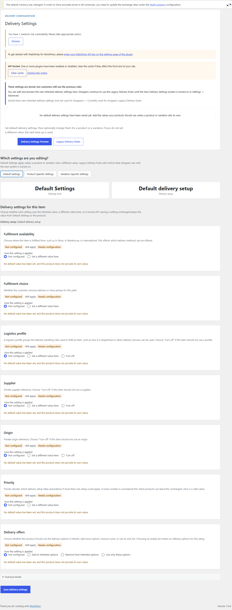
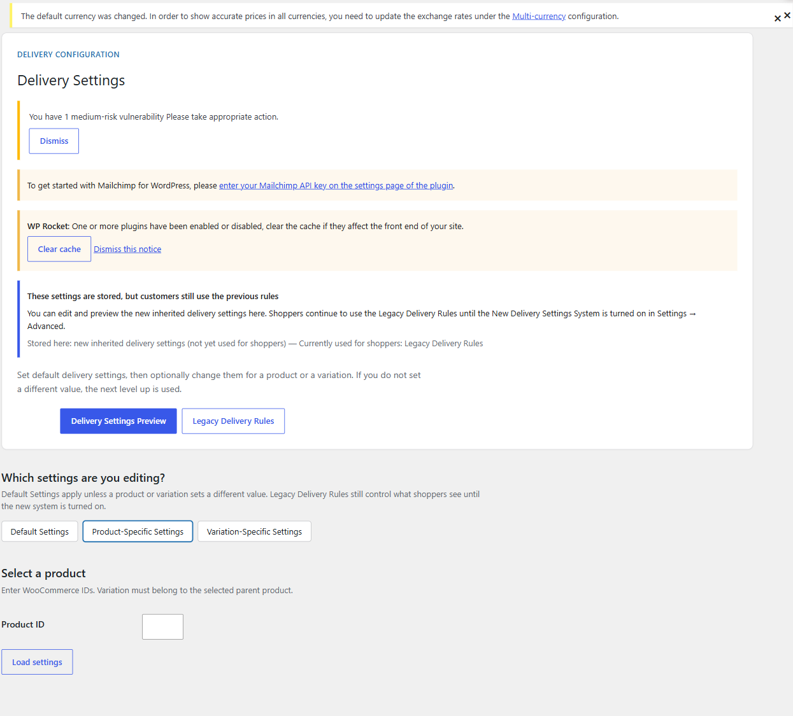
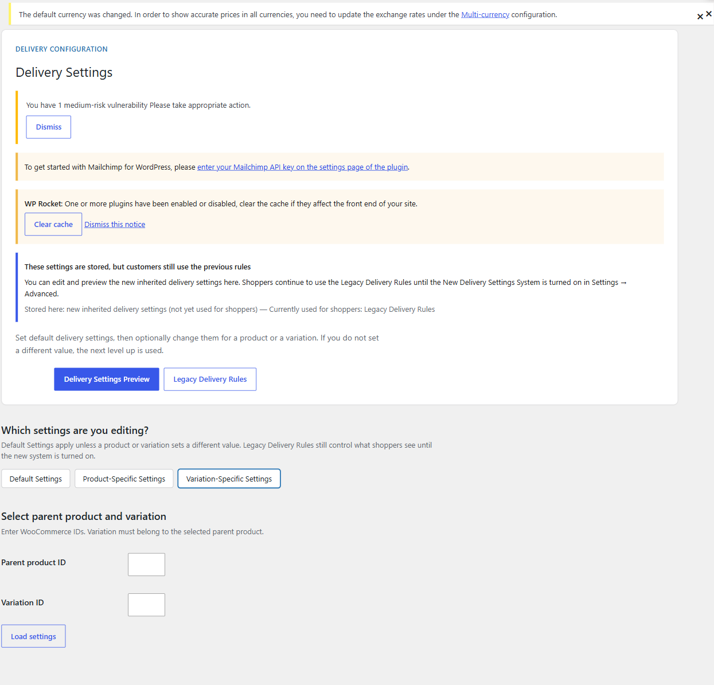
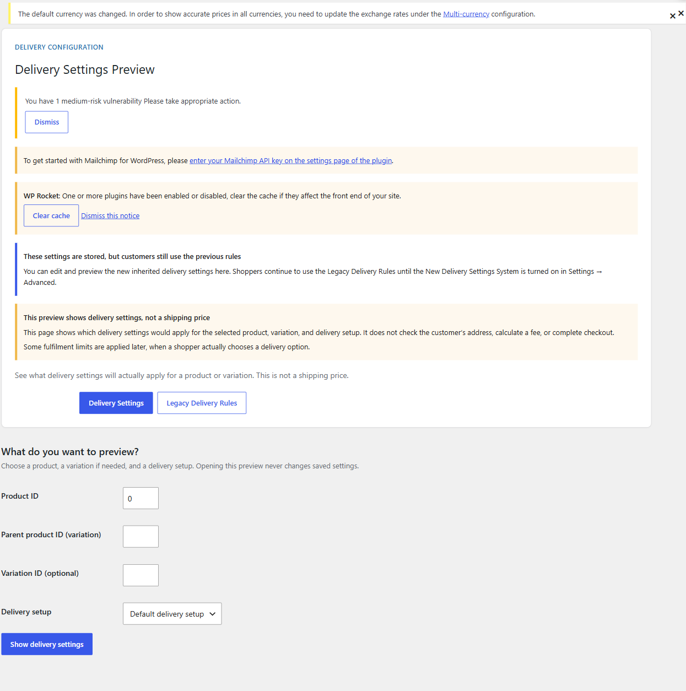
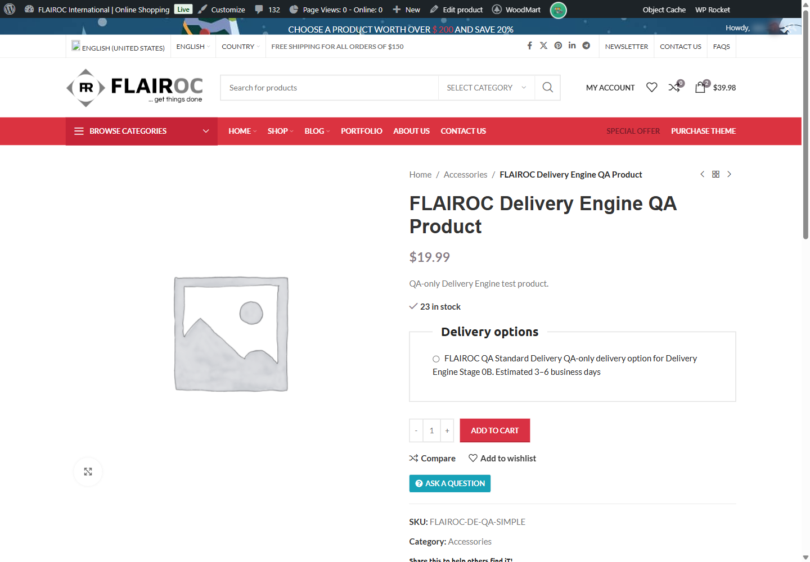
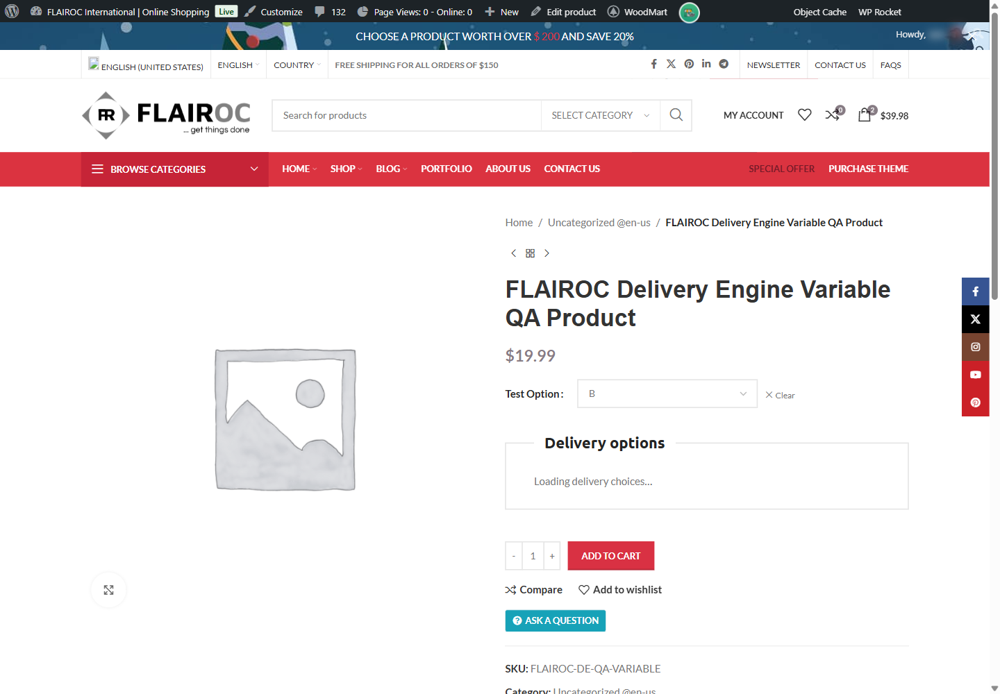
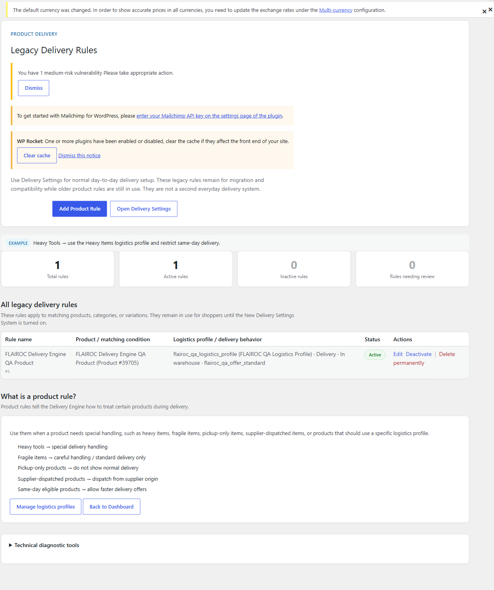
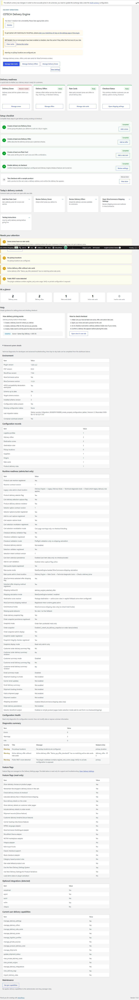
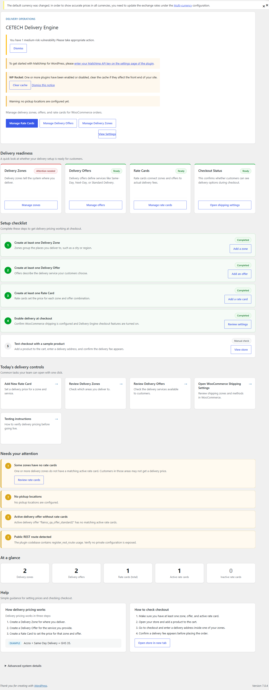

# Visual Walkthrough (screenshot tour)

**Audience:** New staff and trainers  
**Version:** 1.0.0-rc.2  
**Screenshots folder:** [`docs/training/assets/screenshots/`](assets/screenshots/)  
**Inventory:** [`assets/screenshots/README.md`](assets/screenshots/README.md)  
**Videos:** [10 — Video Training Library](10-VIDEO-TRAINING-LIBRARY.md) (companion walkthrough recordings)

For every screen below:

1. **WHERE YOU ARE**
2. **WHAT THIS SCREEN IS FOR**
3. **WHAT STAFF SHOULD LOOK AT**
4. **WHAT STAFF MAY CHANGE**
5. **WHAT STAFF SHOULD NOT CHANGE CASUALLY**
6. **WHAT HAPPENS AFTER SAVE**

Capture status is recorded honestly in the screenshots README (`PLAYWRIGHT-CAPTURED` vs `HUMAN-CAPTURED`). Do not invent images. Prefer QA products **#39705**, **#39717** / A **#39718** / B **#39719**, and existing orders **#39721** / **#39724**.

**Stage 12B note (partial):** Many admin/storefront teaching PNGs are saved; cart shots **10–11** are still missing; checkout/order shots **12–14** were captured but **withheld from git** until PII redaction. See [`assets/screenshots/README.md`](assets/screenshots/README.md). Verdict remains **BLOCKED — VISUAL CAPTURE INCOMPLETE**.

---

## 1. Delivery Settings (everyday entry)

**File:** `01-delivery-settings-home.png`

1. **WHERE YOU ARE:** WordPress admin → **Delivery Engine → Delivery Settings**.  
2. **WHAT THIS SCREEN IS FOR:** The normal staff place to manage store-wide, product, and variation delivery settings.  
3. **WHAT STAFF SHOULD LOOK AT:** Page title **Delivery Settings**; tabs **Default Settings**, **Product-Specific Settings**, **Variation-Specific Settings**; link to **Delivery Settings Preview**.  
4. **WHAT STAFF MAY CHANGE:** Which tab they open for the task at hand.  
5. **WHAT STAFF SHOULD NOT CHANGE CASUALLY:** Legacy Delivery Rules (separate, secondary screen).  
6. **WHAT HAPPENS AFTER SAVE:** N/A until you edit a tab and click Save on that editor.

---

## 2. Default Settings

**File:** `02-default-settings.png`

1. **WHERE YOU ARE:** Delivery Settings → **Default Settings**.  
2. **WHAT THIS SCREEN IS FOR:** Store-wide defaults that products can inherit.  
3. **WHAT STAFF SHOULD LOOK AT:** **Fulfilment availability**, **Fulfilment choice**, **Delivery offers**, and related logistics fields your store uses.  
4. **WHAT STAFF MAY CHANGE:** Clear defaults the catalogue should normally follow.  
5. **WHAT STAFF SHOULD NOT CHANGE CASUALLY:** Experimental toggles without approval; private supplier/origin values if you are not authorised.  
6. **WHAT HAPPENS AFTER SAVE:** Products/variations on **Use inherited setting** pick up the new defaults for **future** shopping. Past orders stay as purchased.

---

## 3. Product-Specific Settings

**File:** `03-product-specific-settings.png`  
*(Optional detail shot: `03b-product-39705-editor.png` for QA product #39705.)*

1. **WHERE YOU ARE:** Delivery Settings → **Product-Specific Settings**.  
2. **WHAT THIS SCREEN IS FOR:** Overrides for one product when it must differ from the default.  
3. **WHAT STAFF SHOULD LOOK AT:** Product ID (practice **#39705**); per-field modes **Use inherited setting** / **Set a different value here** / **Turn off**.  
4. **WHAT STAFF MAY CHANGE:** Only fields that must differ for that product.  
5. **WHAT STAFF SHOULD NOT CHANGE CASUALLY:** Unrelated products; mass overrides that belong in Defaults instead.  
6. **WHAT HAPPENS AFTER SAVE:** That product’s effective settings update. Confirm in **Delivery Settings Preview**.

---

## 4. Variation-Specific Settings

**File:** `04-variation-specific-settings.png`  
*(Optional detail shot: `04b-variation-39718-editor.png` for variation A #39718.)*

1. **WHERE YOU ARE:** Delivery Settings → **Variation-Specific Settings**.  
2. **WHAT THIS SCREEN IS FOR:** Overrides for one variation when it must differ from its parent product.  
3. **WHAT STAFF SHOULD LOOK AT:** Parent product ID (**#39717**) and variation ID (**#39718** or **#39719**); inheritance modes per field.  
4. **WHAT STAFF MAY CHANGE:** Variation-only differences.  
5. **WHAT STAFF SHOULD NOT CHANGE CASUALLY:** Changing the parent when only one variation should differ (or the reverse).  
6. **WHAT HAPPENS AFTER SAVE:** Only that variation’s effective path changes. Confirm in Preview and on the shop.

---

## 5. Delivery Settings Preview (Ready)

**File:** `05-delivery-preview-ready.png`

1. **WHERE YOU ARE:** Delivery Engine → **Delivery Settings Preview**.  
2. **WHAT THIS SCREEN IS FOR:** A read-only check of what will apply before customers buy.  
3. **WHAT STAFF SHOULD LOOK AT:** **Ready** vs **Needs configuration**; **Currently using** which level (Default / Product / Variation).  
4. **WHAT STAFF MAY CHANGE:** Nothing here (read-only).  
5. **WHAT STAFF SHOULD NOT CHANGE CASUALLY:** N/A — return to Delivery Settings to edit.  
6. **WHAT HAPPENS AFTER SAVE:** N/A on Preview. Edits happen on Delivery Settings, then re-check Preview.

---

## 6. Delivery Settings Preview (Needs configuration) — optional

**File:** `06-delivery-preview-needs-configuration.png`  
**Capture rule:** Only if it can be shown safely on a QA item **without** damaging live settings. Otherwise omit and note in the screenshots README.

1. **WHERE YOU ARE:** Same Preview screen, incomplete/misconfigured QA example.  
2. **WHAT THIS SCREEN IS FOR:** Teaching staff what “not ready” looks like.  
3. **WHAT STAFF SHOULD LOOK AT:** The **Needs configuration** (or equivalent) message and which fields are missing.  
4. **WHAT STAFF MAY CHANGE:** Fix the underlying Delivery Settings for that QA item, then re-preview.  
5. **WHAT STAFF SHOULD NOT CHANGE CASUALLY:** Real catalogue products while practising.  
6. **WHAT HAPPENS AFTER SAVE:** After fixing and saving settings, Preview should move toward **Ready**.

---

## 7. Customer product page (simple QA)

**File:** `07-simple-product-customer-delivery.png`  
**QA:** Product **#39705**.

1. **WHERE YOU ARE:** Shop product page for the simple QA product.  
2. **WHAT THIS SCREEN IS FOR:** What customers see when choosing delivery.  
3. **WHAT STAFF SHOULD LOOK AT:** **Delivery options** (and related fulfilment / method / option wording).  
4. **WHAT STAFF MAY CHANGE:** Configuration in admin only — not on this page.  
5. **WHAT STAFF SHOULD NOT CHANGE CASUALLY:** Non-QA catalogue products while training.  
6. **WHAT HAPPENS AFTER SAVE:** After admin Save, refresh this page to verify customer wording and choices.

---

## 8. Customer product page (variable — Variation A)

**File:** `08-variable-product-customer-delivery.png`  
**QA:** Parent **#39717**, Variation A **#39718**.

1. **WHERE YOU ARE:** Shop page for the variable QA product with Variation A selected.  
2. **WHAT THIS SCREEN IS FOR:** Showing that delivery choices follow the selected variation.  
3. **WHAT STAFF SHOULD LOOK AT:** Variation selection controls + **Delivery options**.  
4. **WHAT STAFF MAY CHANGE:** Admin variation settings only.  
5. **WHAT STAFF SHOULD NOT CHANGE CASUALLY:** Live non-QA variations.  
6. **WHAT HAPPENS AFTER SAVE:** Re-select Variation A after admin changes to confirm the customer view.

---

## 9. Customer product page (variable — Variation B)

**File:** `09-variable-product-second-variation.png`  
**QA:** Variation B **#39719**.

1. **WHERE YOU ARE:** Same variable product with Variation B selected.  
2. **WHAT THIS SCREEN IS FOR:** Showing how delivery can change when the variation changes.  
3. **WHAT STAFF SHOULD LOOK AT:** Differences vs Variation A (options, labels, readiness).  
4. **WHAT STAFF MAY CHANGE:** Admin settings for that variation only.  
5. **WHAT STAFF SHOULD NOT CHANGE CASUALLY:** Switching real customer carts during training demos.  
6. **WHAT HAPPENS AFTER SAVE:** Refresh and re-select Variation B to verify.

---

## 10. Cart — delivery information

**File:** `10-cart-delivery-information.png`

1. **WHERE YOU ARE:** Cart / basket with a QA delivery selection.  
2. **WHAT THIS SCREEN IS FOR:** Confirming the customer’s choice carried into the cart.  
3. **WHAT STAFF SHOULD LOOK AT:** Understandable labels such as **Fulfilment**, **Delivery method** / **Delivery option**, estimate when shown.  
4. **WHAT STAFF MAY CHANGE:** Empty training carts when finished.  
5. **WHAT STAFF SHOULD NOT CHANGE CASUALLY:** Payment gateway settings.  
6. **WHAT HAPPENS AFTER SAVE:** N/A for cart; admin config changes may require re-adding/re-selecting.

---

## 11. Multi-product cart — one shipment charge

**File:** `11-multi-product-cart-one-charge.png`

1. **WHERE YOU ARE:** Cart with two compatible QA items.  
2. **WHAT THIS SCREEN IS FOR:** Teaching that compatible items can share one fixed-per-shipment **Delivery** charge (example **25.00** on FLAIROC QA).  
3. **WHAT STAFF SHOULD LOOK AT:** Two line items + a single Delivery charge (not doubled unnecessarily).  
4. **WHAT STAFF MAY CHANGE:** Training cart contents only.  
5. **WHAT STAFF SHOULD NOT CHANGE CASUALLY:** Rate cards / live pricing without approval.  
6. **WHAT HAPPENS AFTER SAVE:** N/A; proceed to checkout only for teaching, stop before payment.

---

## 12. Checkout — Delivery charge

**File:** `12-checkout-delivery-charge.png`

1. **WHERE YOU ARE:** Classic Checkout with a prepared QA cart.  
2. **WHAT THIS SCREEN IS FOR:** Showing the server-authoritative **Delivery** shipping line.  
3. **WHAT STAFF SHOULD LOOK AT:** Shipping line labelled **Delivery** with a real charge (not a silent free/$0 surprise).  
4. **WHAT STAFF MAY CHANGE:** Stop before payment for training.  
5. **WHAT STAFF SHOULD NOT CHANGE CASUALLY:** Enabling COD or new gateways just for screenshots.  
6. **WHAT HAPPENS AFTER SAVE:** Placing a real order creates immutable Delivery information on the order — prefer existing QA orders **#39721** / **#39724** for teaching.

---

## 13. Order — Delivery information

**File:** `13-order-delivery-information.png`  
**QA orders:** **#39721** or **#39724**.  
**Privacy:** Blur customer names, emails, addresses, phones.

1. **WHERE YOU ARE:** WooCommerce order edit screen → **Delivery information** panel.  
2. **WHAT THIS SCREEN IS FOR:** What staff use to fulfil what the customer bought.  
3. **WHAT STAFF SHOULD LOOK AT:** Fulfilment, method/option, **Estimated delivery**, charge, products covered.  
4. **WHAT STAFF MAY CHANGE:** Operational fulfilment work against this snapshot.  
5. **WHAT STAFF SHOULD NOT CHANGE CASUALLY:** Rewriting historical delivery facts to match new Defaults.  
6. **WHAT HAPPENS AFTER SAVE:** Future Default changes do **not** rewrite this past order.

---

## 14. Order — clean shipping line

**File:** `14-order-shipping-clean.png`

1. **WHERE YOU ARE:** Same QA order, shipping / totals area.  
2. **WHAT THIS SCREEN IS FOR:** Confirming shipping looks like normal commerce data (no raw technical internals for staff).  
3. **WHAT STAFF SHOULD LOOK AT:** Clean **Delivery** / shipping amount.  
4. **WHAT STAFF MAY CHANGE:** Nothing required for training — read-only review.  
5. **WHAT STAFF SHOULD NOT CHANGE CASUALLY:** Order line internals or developer metadata.  
6. **WHAT HAPPENS AFTER SAVE:** N/A for this teaching view.

---

## 15. Legacy Delivery Rules (secondary)

**File:** `15-legacy-delivery-rules.png`

1. **WHERE YOU ARE:** Delivery Engine → **Legacy Delivery Rules**.  
2. **WHAT THIS SCREEN IS FOR:** Compatibility / migration awareness — **not** everyday configuration.  
3. **WHAT STAFF SHOULD LOOK AT:** Warning text and links back to **Delivery Settings**.  
4. **WHAT STAFF MAY CHANGE:** Usually nothing; open read-only unless authorised.  
5. **WHAT STAFF SHOULD NOT CHANGE CASUALLY:** Editing legacy rules without explicit approval.  
6. **WHAT HAPPENS AFTER SAVE:** Can affect compatibility paths — escalate before changing.

---

## 16. Technical diagnostic tools (admin / support only)

**File:** `16-technical-diagnostic-tools.png`  
**Audience:** Administrators and technical support — **not** primary new-staff material.

1. **WHERE YOU ARE:** Delivery Engine dashboard / system readiness area.  
2. **WHAT THIS SCREEN IS FOR:** Support diagnostics, not day-to-day selling configuration.  
3. **WHAT STAFF SHOULD LOOK AT:** High-level readiness only unless you are support.  
4. **WHAT STAFF MAY CHANGE:** Follow support runbooks only.  
5. **WHAT STAFF SHOULD NOT CHANGE CASUALLY:** Advanced system details, debug toggles, or anything that looks developer-only.  
6. **WHAT HAPPENS AFTER SAVE:** Depends on the control — when unsure, do not save; ask support.

---

## Optional: Delivery Engine dashboard overview

**File:** `00-delivery-engine-dashboard.png` (optional teaching extra)

1. **WHERE YOU ARE:** Delivery Engine overview / readiness.  
2. **WHAT THIS SCREEN IS FOR:** Finding everyday links (Delivery Settings, offers, zones, rate cards).  
3. **WHAT STAFF SHOULD LOOK AT:** Navigation into Delivery Settings.  
4. **WHAT STAFF MAY CHANGE:** Follow links; do not treat this as the main editor.  
5. **WHAT STAFF SHOULD NOT CHANGE CASUALLY:** Collapsed Advanced system details.  
6. **WHAT HAPPENS AFTER SAVE:** N/A (mostly informational).
